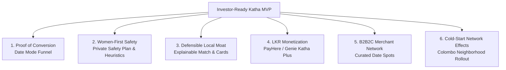

# 💼 Project Katha (Mingle.lk) — Investor Readiness & Fundraising Playbook

> **Strategic guide for pre-seed / angel fundraising in relationship technology.**  
> How to turn Project Katha from a working technical prototype into an irresistible, venture-backable startup.

---

## 🎯 The Investment Thesis: "Why Katha? Why Now? Why Sri Lanka?"

### 1. The Market Gap (The "Dating App Fatigue" Crisis)
* **The Global Failure in Emerging Markets**: Western apps (Tinder, Bumble, Hinge) were engineered around binary swipe decks optimized for vanity and ad-impressions, not relationship formation. In South Asia, this results in an abysmal **<2% match-to-date conversion rate**, ghosting rates over 80%, and rampant safety anxieties.
* **The Cultural Polarization**: Sri Lankans currently have only two extremes:
  1. *Rigid Matrimonial Sites* (Shaadi, LankaMatrimony, newspaper classifieds): Controlled by parents/horoscopes, formal, high social stigma for youth under 30.
  2. *Superficial Swipe Decks* (Tinder): Stigmatized as "hookup only", saturated with inactive/fake profiles, fear of social exposure in small social circles.
* **The Katha Opportunity**: Katha occupies the massive, high-intent middle ground:
  $$\text{Discover} \longrightarrow \text{Understand (Connection Cards)} \longrightarrow \text{Connect} \longrightarrow \text{Meet (Date Mode)}$$
  A culturally intelligent, safe relationship platform designed specifically for the realities of modern Sri Lankan youth and young professionals.

---

## 🏛️ The 6 Pillars of an Investor-Attracting MVP

Investors in consumer social / relationship tech look for six concrete proofs. Here is how Katha delivers each one:

---

### Pillar 1: Proof of Real-World Conversion (The "Date Mode" Funnel)
* **What Investors Demand**: Swipe totals and registered user counts are vanity metrics. Investors care about **"Date Proposals Initiated per 100 Matches"** and **"Day-7 Re-engagement Rate"**.
* **MVP Deliverable**:
  - Live Admin Funnel tracking every step: `Signup → Cards Answered → Connection Note Sent → Match Formed → 10+ Messages Exchanged → Date Mode Scheduled`.
  - Proves that Katha actually gets two people to sit across from each other in a safe cafe in Colombo, Kandy, or Galle.
* **Tracking Issue**: [#7 Cohort Retention & Full Conversion Funnel Analytics](https://github.com/chirana07/Mingle.lk/issues/7)

---

### Pillar 2: Women-First Trust & Safety Infrastructure
* **What Investors Demand**: In South Asia, female user retention is the single determining factor of platform survival. If women do not feel 100% safe from harassment, catfishing, and physical exposure, liquidity collapses.
* **MVP Deliverable**:
  - **Neighborhood-Level Privacy**: Displays "Colombo 05" or "Kandy City", never precise GPS pins.
  - **Automated Anti-Scam Heuristics**: Immediate backend detection and flagging of financial solicitations, bank account numbers, crypto solicitations, and external URL redirects.
  - **Zero-Shame Private Safety Plan**: Discreetly schedules automated check-ins and sends SMS check-in notifications to emergency contacts via Notify.lk / Dialog IdeaMart gateway without notifying the match.
* **Tracking Issue**: [#6 Automated Emergency SMS Check-in Integration](https://github.com/chirana07/Mingle.lk/issues/6)

---

### Pillar 3: Defensible Technological & Cultural Moat
* **What Investors Demand**: *"What stops Tinder or Bumble from copying you tomorrow?"*
* **The Katha Moat**:
  1. **Interactive Connection Cards**: Contextual situational icebreakers tailored to Sri Lankan life (e.g. *Down-south weekend vs cafe hopping in Colombo 07*, *Favorite street kottu spot*).
  2. **Explainable Multi-Factor Compatibility Engine**: Transparent mathematical weighting of Intent (25%), Lifestyle (20%), Card alignment (20%), Passions (15%), Communication (10%), and Geography (10%). Matches see *why* they match.
  3. **Trilingual Localization**: First-class Sinhala (`si`), Tamil (`ta`), and English (`en`) support with localized voice prompt intros.
* **Tracking Issues**: [#1 Voice Prompts](https://github.com/chirana07/Mingle.lk/issues/1), [#9 Trilingual Voice Prompt Snippets](https://github.com/chirana07/Mingle.lk/issues/9)

---

### Pillar 4: LKR Monetization & Unit Economics (Katha Plus)
* **What Investors Demand**: Proof that users in Sri Lanka will pay real currency (LKR), overcoming foreign exchange barriers that cripple Tinder Gold or Bumble Premium.
* **MVP Deliverable**:
  - Local Payment Gateway Integration (**PayHere**, **Genie**, **FriMi**, or **Dialog/Mobitel Direct Carrier Billing**).
  - Micro-pricing tiers:
    - **LKR 490/week** or **LKR 1,490/month** for "Katha Plus"
    - 5 extra Connection Cards per week
    - View users who responded to your prompt cards
    - Priority spotlight in your home district
* **Tracking Issue**: [#4 PayHere / Local Gateway Micro-Subscription Engine](https://github.com/chirana07/Mingle.lk/issues/4)

---

### Pillar 5: B2B2C Curated Date Spot Ecosystem
* **What Investors Demand**: Organic Customer Acquisition Cost (CAC) reduction and offline network effects.
* **MVP Deliverable**:
  - Vetted partner cafes and tea lounges in Colombo (Barefoot Garden Cafe, Black Cat Cafe, Cafe Kumbuk, The Dutch Hospital), Kandy (The Empire Cafe), and Galle Fort.
  - In-app 15% discount vouchers for confirmed Katha dates.
  - Merchant Partner QR verification portal.
  - **Why this wins**: Partner venues display Katha branding on cafe tables ("Book your next date here via Katha"), driving zero-CAC organic installs.
* **Tracking Issue**: [#8 Verified Date Spot Merchant Partner Portal](https://github.com/chirana07/Mingle.lk/issues/8)

---

### Pillar 6: Go-to-Market (GTM) & Cold-Start Playbook
* **What Investors Demand**: A clear plan to conquer the initial "chicken-and-egg" network liquidity dilemma.
* **The Colombo Density Rollout Strategy**:
  1. **Phase 1: Hyper-Concentrated Density (Colombo 03, 04, 05, 07)**
     - Target: 1,000 active, verified early users within a 5km radius before marketing anywhere else.
     - University & young professional ambassador programs (APIIT, SLIIT, Colombo Medical Faculty, tech companies in Colombo 02/03).
  2. **Phase 2: The Two-Hub Corridor (Colombo ⟷ Galle / Kandy)**
     - Expanding to weekend travel corridors where high-intent professionals frequently move.
  3. **Phase 3: Sri Lankan Diaspora Expansion**
     - UK, Australia, Canada, UAE, and Singapore diaspora looking for intentional partners connected back to Sri Lanka.

---

## 🎙️ The 3-Minute Live Investor Pitch Script

During an angel or VC pitch meeting, follow this exact sequence using the app running on `http://localhost:3000`:

1. **Minute 0:00 – The Hook**
   > *"Every single dating app in South Asia is broken because it treats dating like an infinite swipe deck. Women feel unsafe, men get ghosted, and less than 2% of matches ever meet in real life. We built Project Katha (Mingle.lk) to fix this."*
2. **Minute 0:45 – The Solution (Show Discovery & Connection Cards)**
   > *"Instead of swiping on photos, our users discover each other through contextual Connection Cards. See how Senuri and Kasun both chose 'Southern swell and sunset'? That shared answer creates an organic, zero-friction conversation starter."*
3. **Minute 1:30 – Explainable Matching & Trust**
   > *"Our algorithm doesn't use fake percentages; it explains why they match: shared intent, aligned lifestyle pace, and 3 mutual passions. And Kasun never sees Senuri's home GPS coordinates—only 'Colombo 05'."*
4. **Minute 2:15 – Date Mode & Monetization**
   > *"When they're ready to meet, our integrated Date Mode proposes a vetted, safe public cafe like Barefoot in Colombo with a pre-negotiated 15% discount. Senuri can activate a Private Safety Plan that discreetly texts her emergency contact when she arrives."*
5. **Minute 2:45 – The Business & Ask (Switch to Admin Dashboard)**
   > *"In our admin panel, you can see our live unit economics: date conversion rate, cohort retention, and our PayHere micro-subscription tier at LKR 1,490/month. We are raising our pre-seed round to conquer Colombo density and expand to Galle and Kandy."*

---

## 📊 Pre-Seed Investor Due Diligence Checklist

| Milestone Deliverable | Status | Tracking Link |
|---|---|---|
| Responsive PWA (Mobile-first + Desktop frame) | ✅ Done | [frontend/src/app/page.tsx](file:///Users/chirana/IdeaProjects/Mingle.lk/frontend/src/app/page.tsx) |
| Explainable Matching Engine (FastAPI + Async SQLAlchemy) | ✅ Done | [backend/app/services/matching.py](file:///Users/chirana/IdeaProjects/Mingle.lk/backend/app/services/matching.py) |
| 100+ Realistic Sri Lankan Seed Profiles | ✅ Done | [backend/seed/seed_data.py](file:///Users/chirana/IdeaProjects/Mingle.lk/backend/seed/seed_data.py) |
| Realtime WebSocket Chat with Anti-Scam Filters | ✅ Done | [backend/app/api/v1/chat.py](file:///Users/chirana/IdeaProjects/Mingle.lk/backend/app/api/v1/chat.py) |
| Curated Date Mode with Colombo/Kandy/Galle Venues | ✅ Done | [frontend/src/components/DateModeModal.tsx](file:///Users/chirana/IdeaProjects/Mingle.lk/frontend/src/components/DateModeModal.tsx) |
| Trilingual Internationalization (`en`, `si`, `ta`) | ✅ Done | [frontend/src/i18n/](file:///Users/chirana/IdeaProjects/Mingle.lk/frontend/src/i18n) |
| Automated CI Pipeline (Backend Tests + Frontend Build) | ✅ Passing | [.github/workflows/ci.yml](file:///Users/chirana/IdeaProjects/Mingle.lk/.github/workflows/ci.yml) |
| Interactive Guided Pitch Walkthrough Mode | 📌 Open | [GitHub Issue #5](https://github.com/chirana07/Mingle.lk/issues/5) |
| PayHere / Genie LKR Micro-Subscription Flow | 📌 Open | [GitHub Issue #4](https://github.com/chirana07/Mingle.lk/issues/4) |
| Automated Emergency SMS Check-in Integration | 📌 Open | [GitHub Issue #6](https://github.com/chirana07/Mingle.lk/issues/6) |
| Cohort Retention Waterfall in Admin Dashboard | 📌 Open | [GitHub Issue #7](https://github.com/chirana07/Mingle.lk/issues/7) |
| Date Spot Merchant Partner Discount Portal | 📌 Open | [GitHub Issue #8](https://github.com/chirana07/Mingle.lk/issues/8) |
| 15s Trilingual Voice Prompt Snippets | 📌 Open | [GitHub Issue #9](https://github.com/chirana07/Mingle.lk/issues/9) |
