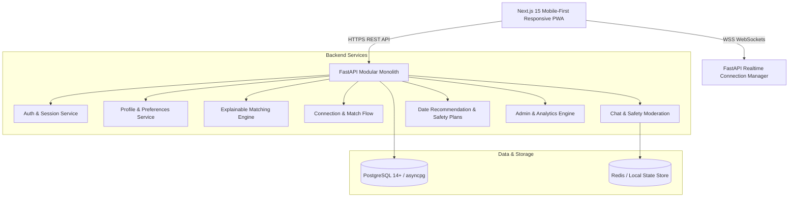

# Project Katha (Mingle.lk) — Investor-Ready MVP

> A Sri Lankan-first relationship discovery platform designed to turn compatibility into safe real-world connections.

[](https://fastapi.tiangolo.com)
[](https://nextjs.org)
[](https://www.postgresql.org)
[](https://www.typescriptlang.org)
[](https://tailwindcss.com)

---

## 1. Product Overview

Conventional dating platforms (Tinder, Bumble, Hinge, Badoo) are built around rapid binary swiping decks that commodify people into image catalogues. In Sri Lanka, this paradigm produces high friction: superficial matching, ghosting, awkward opening messages, safety and privacy anxieties, and matches that rarely translate into safe real-world dates.

**Project Katha** replaces the swipe deck with an intentional discovery architecture:
$$\text{Discover} \longrightarrow \text{Understand} \longrightarrow \text{Connect} \longrightarrow \text{Meet}$$

Rather than forcing users into matrimonial biodata or Western hookup tropes, Katha accommodates diverse relationship intentions (serious, intentional dating, open exploration, casual) while grounding discovery in local context: neighborhood-level privacy (e.g. *Colombo 05*, *Kandy City*, *Galle Fort*), interactive **Connection Cards**, vetted public **Date Mode** recommendations with budget brackets, and a zero-shame **Private Safety Plan**.

---

## 2. Key Differentiators & Signature Features

### 1. Interactive Connection Cards
Lightweight situational and values-based interaction primitives (e.g. *"Pick your ideal Saturday in Sri Lanka: Southern swell & sunset vs. Cafe hopping in Colombo 07"*). Shared answers highlight mutual alignment and generate organic, contextual opening conversation starters.

### 2. Explainable Multi-Factor Compatibility Engine
A configurable weighted scoring algorithm that transparently explains *why* two profiles match (e.g. *"Aligned intention: Both looking for dating intentionally"*, *"3 shared passions: Specialty Coffee, Surfing, Literature"*), avoiding opaque pseudoscience percentages.

### 3. Integrated "Date Mode" & Local Venue Discovery
Bridges digital chat into real-world meetings with curated safe, high-foot-traffic public venues in Colombo, Kandy, and Galle with transparent budget tiers (*Free*, *Under LKR 2,000*, *LKR 2,000–5,000*, *Flexible*).

### 4. Zero-Shame Trust & Safety Layer
- Multi-tier verification indicators (Phone OTP, Email, Photo/Selfie verification).
- Neighborhood-level location filtering (never exposes exact GPS coordinates or street addresses).
- **Private Safety Plan**: Allows users to schedule private check-in alerts and store trusted emergency contact details without alerting the match.
- Automated anti-scam heuristic scanning (detects unauthorized banking, wire transfers, crypto solicitations, and external redirects).

### 5. Multilingual by Design
Tri-lingual internationalization architecture supporting English (`en`), Sinhala (`si`), and Tamil (`ta`) out of the box with a real-time UI language switcher.

---

## 3. System Architecture & Tech Stack



### Technology Breakdown

| Component | Technology | Rationale |
| :--- | :--- | :--- |
| **Frontend** | Next.js 15 (App Router), TypeScript, Tailwind CSS | Mobile-first responsive UI with glassmorphic preview frame on desktop for investor demonstrations. |
| **Backend** | Python 3.10+, FastAPI, Pydantic v2 | High throughput, asynchronous async/await, native WebSockets, clean domain separation. |
| **Database** | PostgreSQL 14+, SQLAlchemy 2.0 Async (`asyncpg`) | Relational integrity with UUID primary keys, composite discovery indexes, and SQLite fallback for tests. |
| **Authentication** | Passwordless Phone/Email OTP + JWT Bearer Tokens | Secure, frictionless onboarding matching local mobile habits. |
| **Realtime** | Native FastAPI WebSockets | Instant messaging, typing presence, and match notifications. |
| **Icons & UI** | Lucide React | Clean, modern iconography without bloated design libraries. |

---

## 4. Repository & Folder Structure

```
Mingle.lk/
├── .env.example                  # Environment configuration template
├── README.md                     # Comprehensive documentation
├── pytest.ini                    # Pytest asynchronous configuration
├── docs/
│   ├── architecture.md           # Detailed technical architecture specification
│   └── product-decisions.md      # Product decisions log (decisions, trade-offs, validations)
├── backend/
│   ├── app/
│   │   ├── api/                  # FastAPI routers and dependency injection
│   │   │   ├── deps.py           # JWT auth and admin permission dependencies
│   │   │   └── v1/               # Versioned REST endpoints (auth, profiles, cards, discovery, chat, dates, admin)
│   │   ├── core/                 # Config, async database engine, bcrypt security
│   │   ├── models/               # SQLAlchemy 2.0 ORM models (User, Profile, Card, Match, Chat, Date, Safety)
│   │   ├── schemas/              # Pydantic v2 validation models
│   │   ├── services/             # Core business logic (Matching engine, Safety, Date recommendations)
│   │   └── main.py               # Application entrypoint & startup lifespan
│   ├── seed/
│   │   └── seed_data.py          # Generator for 100+ fictional Sri Lankan profiles and demo states
│   └── tests/                    # Pytest test suite (unit, integration, safety heuristics)
└── frontend/
    ├── src/
    │   ├── app/                  # Next.js App Router (layout, page, globals.css)
    │   ├── components/           # Mobile UI components (DiscoveryFeed, Chat, DateMode, Admin, Navigation)
    │   ├── i18n/                 # Internationalization strings (en.json, si.json, ta.json)
    │   └── lib/                  # Typed API client and TypeScript definitions
    └── package.json
```

---

## 5. Database Schema & Entities

The relational database architecture is built around clean separation between authentication credentials, public profile projections, and safety records:

* **`users`**: Secure account record (`id`, `phone`, `email`, `role`, `status`, privacy flags, trust indicators).
* **`profiles`**: Conversational profile (`user_id`, `first_name`, `birth_date`, `city`, `neighborhood`, `bio`, `occupation`, `relationship_intent`, `lifestyle_pace`, `interests`, `languages`).
* **`connection_cards` & `card_answers`**: Interactive cards and user responses with selected keys and comments.
* **`connection_requests`**: Targeted connection notes anchored to specific cards or prompts.
* **`matches`**: Mutual connections with `compatibility_score` and `match_reasons` JSON array.
* **`conversations` & `messages`**: Real-time chat messages with read timestamps and safety flag heuristics.
* **`date_plans` & `date_safety_plans`**: Low-pressure venue plans, budget brackets, trusted contact check-in details.
* **`reports` & `blocks`**: Confidential reporting queue and mutual account isolation.
* **`analytics_events`**: Funnel event tracking (`signup`, `connection_sent`, `match_created`, `date_planned`).

---

## 6. Local Development Setup

### Prerequisites
- Node.js v18+ and npm
- Python 3.10+
- PostgreSQL 14+ (or SQLite fallback)

### Step 1: Clone and Configure Environment
```bash
git clone <repo-url> Mingle.lk
cd Mingle.lk
cp .env.example .env
```

### Step 2: Set up Backend Virtual Environment
```bash
python3 -m venv venv
source venv/bin/activate
pip install -r <(cat << 'EOF'
fastapi
uvicorn[standard]
sqlalchemy[asyncio]
asyncpg
aiosqlite
pydantic
pydantic-settings
python-jose[cryptography]
bcrypt
python-multipart
pytest
pytest-asyncio
httpx
EOF
)
```

### Step 3: Run Database Seed Script
Populates the database with 100+ realistic fictional Sri Lankan profiles across Colombo, Kandy, Galle, and Negombo:
```bash
PYTHONPATH=. ./venv/bin/python3 -m backend.seed.seed_data
```

### Step 4: Run Backend Server
```bash
./venv/bin/uvicorn backend.app.main:app --host 0.0.0.0 --port 8000 --reload
```
API Documentation will be live at: `http://localhost:8000/docs`

### Step 5: Run Frontend Application
In a separate terminal:
```bash
cd frontend
npm install
npm run dev -- -p 3000
```
Open your browser at: `http://localhost:3000`

---

## 7. Investor Demo Fast-Track Credentials

The application includes pre-configured demo profiles for frictionless evaluation:

| Persona | Phone / Email | OTP Code | Description |
| :--- | :--- | :--- | :--- |
| **Demo User** (Senuri) | `+94771234567` | `123456` | 24-year-old UX Designer in Colombo 05. Pre-seeded with active matches, chat history, incoming requests, and a proposed date at Barefoot Garden Cafe. |
| **Platform Admin** | `admin@mingle.lk` | `123456` | Platform Moderator with access to live North-Star metrics, conversion funnels, user management, and moderation queue. |

*Tip: On the frontend header or login modal, click **"Demo User"** or **"Admin"** to log in instantly with one click.*

---

## 8. Automated Testing

Run the automated backend test suite:
```bash
./venv/bin/pytest backend/tests -v
```

Test coverage includes:
- **Authentication**: Phone OTP generation, verification, and JWT session issuance.
- **Explainable Matching**: Weighted scoring, alignment explanations, and connection card comparison.
- **Connection & Date Flow**: Connection requests, mutual match formation, conversation creation, date plan proposals, and safety plan generation.
- **Anti-Scam Heuristics**: Financial solicitation, unauthorized bank transfer requests, crypto schemes, and external redirect detection.

---

## 9. Security & Privacy Highlights

1. **Zero Exact GPS Storage**: Locations are stored and displayed strictly at the neighborhood or city level (e.g. *Colombo 05*, *Kandy City*), eliminating physical stalking vectors.
2. **Confidential Reporting**: Reported users are silently auto-blocked and isolated without revealing the reporter's identity.
3. **Data Protection**: Sensitive records (phone numbers, OTP hashes, trusted emergency contacts) are isolated from public profile serialization projections.
4. **Scam Prevention**: Chat heuristic filters flag high-frequency financial keywords before irreversible fraud occurs.

---

## 10. Future Product Roadmap

- **Phase 1 (Current MVP)**: Sri Lankan-first relationship discovery, Connection Cards, Date Mode, Safety Plans, Admin Dashboard.
- **Phase 2**: Machine learning-assisted conversation coaching and profile prompt quality recommendations.
- **Phase 3**: Local Business Date Marketplace (partnering with cafes, restaurants, art spaces for curated discounts).
- **Phase 4**: Verified Offline Community Events (Colombo singles coffee crawls, Kandy trail walks, Galle surf meetups).
- **Phase 5**: University and professional campus community verification circles.
- **Phase 6**: Regional South Asian expansion tailored to local cultural contexts.
