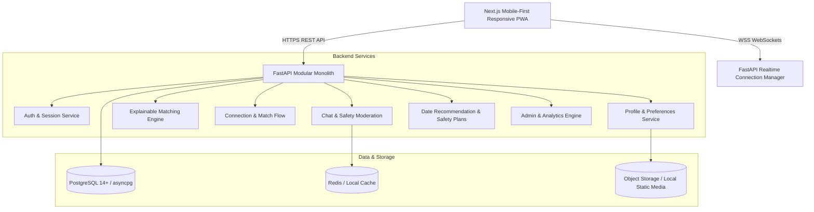

# Architecture Specification — Project Katha (Mingle.lk)

## 1. System Overview
Project Katha is a Sri Lankan-first relationship discovery platform engineered as a high-performance modular monolith.

## 2. Component Specifications

### 2.1 Frontend
* **Framework**: Next.js 14+ (App Router), React 18/19, TypeScript
* **Styling**: Tailwind CSS with custom design tokens (Deep Indigo `#1E1B4B`, Warm Cream `#FDFBF7`, Soft Coral `#F472B6`, Sunset Amber `#F59E0B`, Emerald `#10B981`)
* **Icons & UI**: Lucide React, Radix UI primitives
* **Form Validation**: Zod, React Hook Form
* **State Management**: TanStack Query / React Context for real-time WebSocket state
* **Target Viewports**: Mobile-first (375px - 430px core width), with a sleek mobile shell preview on desktop screens.

### 2.2 Backend
* **Framework**: FastAPI (Python 3.10+)
* **Architecture**: Domain-Driven Modular Monolith (`app/api`, `app/core`, `app/models`, `app/schemas`, `app/services`)
* **ORM**: SQLAlchemy 2.0 (Async engine with `asyncpg`)
* **Validation**: Pydantic v2 schemas
* **Authentication**: Stateless JWT access tokens + refresh tokens, with simulated SMS/Email OTP handler
* **Realtime**: Native FastAPI WebSocket router managing active room connections, read receipts, and typing indicators
* **Background Tasks**: FastAPI `BackgroundTasks` for audit logs, trust score updates, and analytics event logging

### 2.3 Database
* **Database Engine**: PostgreSQL 14+
* **Testing Fallback**: SQLite via `aiosqlite` for zero-dependency test suites
* **Key Design Decisions**:
  * UUID primary keys for all entities
  * Strict foreign key constraints and composite indexes on discovery filters (`city`, `intent`, `age`, `created_at`)
  * Soft delete timestamps (`deleted_at`) for GDPR/privacy compliance and account hiding
  * Separate public profile read projections from private user security records (phone, OTP hash, trusted contacts)

### 2.4 Safety & Moderation Pipeline
* Anti-scam keyword filter hooks (flagging unauthorized bank transfer requests, external telegram links, high-frequency spam)
* Granular reporting queue categorized by Harassment, Inappropriate Media, Impersonation, and Scam
* Two-sided trust feedback loops post-date to silently build internal reputation without public rating shaming
